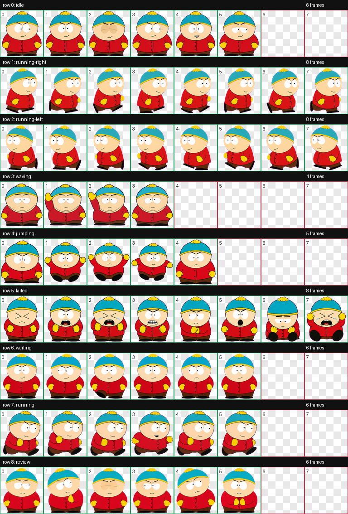
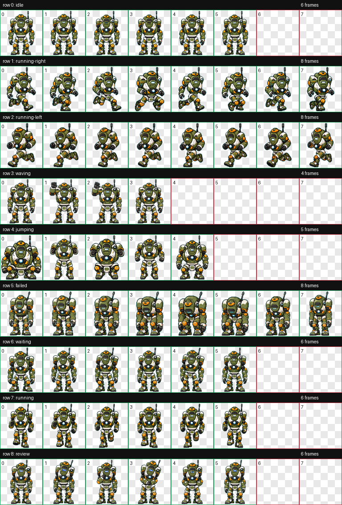

# Codex Pets

Custom Codex pet collection and distribution workspace.

## Pet Previews

### Cartman — [`dist/cartman`](dist/cartman)



| idle | running-right | running-left |
| --- | --- | --- |
| <video src="pets/cartman/qa/videos/idle.mp4" controls></video> | <video src="pets/cartman/qa/videos/running-right.mp4" controls></video> | <video src="pets/cartman/qa/videos/running-left.mp4" controls></video> |

| waving | jumping | failed |
| --- | --- | --- |
| <video src="pets/cartman/qa/videos/waving.mp4" controls></video> | <video src="pets/cartman/qa/videos/jumping.mp4" controls></video> | <video src="pets/cartman/qa/videos/failed.mp4" controls></video> |

| waiting | running | review |
| --- | --- | --- |
| <video src="pets/cartman/qa/videos/waiting.mp4" controls></video> | <video src="pets/cartman/qa/videos/running.mp4" controls></video> | <video src="pets/cartman/qa/videos/review.mp4" controls></video> |

### BT Buddy — [`dist/bt-buddy`](dist/bt-buddy)



| idle | running-right | running-left |
| --- | --- | --- |
| <video src="pets/bt-buddy/qa/videos/idle.mp4" controls></video> | <video src="pets/bt-buddy/qa/videos/running-right.mp4" controls></video> | <video src="pets/bt-buddy/qa/videos/running-left.mp4" controls></video> |

| waving | jumping | failed |
| --- | --- | --- |
| <video src="pets/bt-buddy/qa/videos/waving.mp4" controls></video> | <video src="pets/bt-buddy/qa/videos/jumping.mp4" controls></video> | <video src="pets/bt-buddy/qa/videos/failed.mp4" controls></video> |

| waiting | running | review |
| --- | --- | --- |
| <video src="pets/bt-buddy/qa/videos/waiting.mp4" controls></video> | <video src="pets/bt-buddy/qa/videos/running.mp4" controls></video> | <video src="pets/bt-buddy/qa/videos/review.mp4" controls></video> |

## Layout

```text
codex-pets/
  dist/
    <pet-id>/
      pet.json
      spritesheet.webp
  pets/
    <pet-id>/
      README.md
      package/
        pet.json
        spritesheet.webp
      qa/
        contact-sheet.png
        videos/
        review.json
        run-summary.json
      source/
        decoded/
        final/
        prompts/
        references/
        imagegen-jobs.json
        pet_request.json
```

`dist/<pet-id>` is the minimal installable package to share with others. Copy that folder into:

```bash
~/.codex/pets/<pet-id>
```

`pets/<pet-id>` keeps the working archive for future revisions: QA contact sheet, preview videos, prompts, references, decoded rows, and validation outputs.

## Install A Pet Locally

From this workspace:

```bash
# Install one or more pets
./install-pet.sh bt-buddy cartman

# List available pets
./install-pet.sh --list
```

Or manually:

```bash
PET_ID=cartman
mkdir -p ~/.codex/pets/$PET_ID
cp -R dist/$PET_ID/. ~/.codex/pets/$PET_ID/
```

Then choose the pet in Codex's pet selector. If the UI does not refresh immediately, switch to another pet and back.

## Add A New Pet

1. Generate and validate the pet with the `hatch-pet` workflow.
2. Copy the minimal package into `dist/<pet-id>/`.
3. Copy QA and source artifacts into `pets/<pet-id>/`.
4. Add a short `pets/<pet-id>/README.md` with install notes and known caveats.
